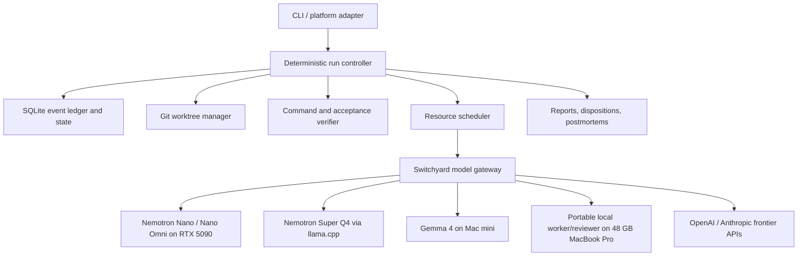
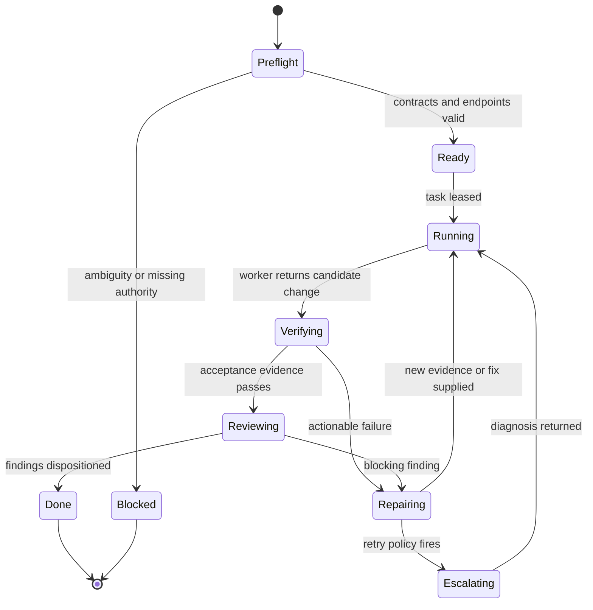

# Product Requirements Document: Savviety Local-First Agent Runner

**Date:** 2026-08-11  
**Status:** Draft ready for implementation planning  
**Owner:** Gary  
**Working product name:** Savviety Local-First Agent Runner  
**Target implementation repository:** New standalone repository, `~/repos/savviety-agent-runner`  
**Primary integration repository:** `~/repos/savviety-skills`

## 1. Executive summary

Build a provider-neutral agent execution runtime that consumes Savviety PRDs and implementation plans, delegates routine implementation and verification work to local NVIDIA Nemotron models, uses the existing Gemma 4 instance on the Mac mini as an independent critic, uses the 48 GB unified-memory MacBook Pro as a portable secondary worker/reviewer and failover pool, escalates difficult or consequential reasoning to local Nemotron Super, and calls paid frontier models only when explicit evidence shows that local models are insufficient or the risk merits independent frontier review.

The product will preserve the strongest ideas already present in `savviety-skills`: requirements readiness, closed decisions, deterministic plan contracts, dependency-aware task execution, disjoint write scopes, isolated Git worktrees, focused verification, milestone review gates, adversarial review, finding disposition, loop fuses, retry budgets, resumability, and structured postmortems. It will move deterministic operations out of prompts and into code. Models will reason, edit, review, and diagnose; the runtime will own parsing, scheduling, Git operations, scope enforcement, command execution, budgets, evidence capture, state transitions, and reporting.

The economic objective is not to eliminate frontier models. It is to make frontier use sparse, explainable, high-leverage, and budgeted while keeping the majority of tokens, tool calls, and implementation work local.

## 2. Problem statement

Gary's existing Claude `execute-plan` workflow demonstrates a mature governed-development process, but its execution depends on Claude-specific primitives such as the Workflow tool, `agent()`, `/code-review`, `/verify`, Skill invocation, and Claude permissions/hooks. Important deterministic operations are currently delegated through natural-language prompts, including plan parsing, Git branch discovery and merging, verification decisions, and changed-file reporting.

This creates five strategic problems:

1. **Provider cost exposure.** Every implementation, retry, review, and merge-resolution call can consume frontier-model tokens even when the task is mechanical.
2. **Provider coupling.** Workflow semantics depend on Claude-specific tools and cannot directly exploit Nemotron, Gemma, OpenAI, or other backends.
3. **Weak evidence boundaries.** A model can report `done`, changed files, or passing verification without the controller independently proving those claims.
4. **Prompt overload.** Durable policy, task data, tool instructions, operational mechanics, and reporting schemas are concatenated into large prompts, increasing cost and reducing adherence.
5. **Limited resource awareness.** The workflow does not schedule around the actual local topology: one RTX 5090 with 32 GB VRAM and 128 GB DDR5, an independently available Gemma 4 server on a Mac mini, and a MacBook Pro with 48 GB of Apple unified memory.

Without a local-first runtime, increasing use will raise variable API spending and make later migration more disruptive. The system should be built now while the existing workflow contracts and prompts can be treated as a known-good behavioral baseline.

## 3. Product thesis

> Use deterministic software to govern work, local models to perform most work, independent models to challenge it, and frontier models only to resolve high-value uncertainty.

## 4. Goals

### 4.1 Primary goals

1. Execute an existing Savviety implementation plan end to end without requiring Claude as the implementation model.
2. Keep at least 85% of implementation-model calls and at least 80% of generated implementation tokens local during the pilot; raise the target after measurement.
3. Preserve or improve the delivery confidence of the current `execute-plan` workflow.
4. Make every frontier call attributable to a routing rule, risk trigger, failed local attempt, or explicit user request.
5. Preserve the existing human authority model: product decisions, accepted risks, destructive operations, and budget overrides remain human-owned.
6. Produce durable run artifacts that can improve prompts, routing policies, tests, closed decisions, and review rubrics over time.
7. Keep model providers replaceable. No workflow rule may depend directly on a provider-specific response shape.

### 4.2 Secondary goals

1. Allow Claude Code, Codex, and future platform skills to invoke the same canonical runtime.
2. Use the RTX workstation, Mac mini, and MacBook Pro concurrently when their resource pools and network availability permit.
3. Support text, code, image, document, audio, and GUI-oriented work through model capability routing.
4. Enable later integration with NeMo Agent Toolkit evaluation and observability without making it a hard dependency of the first usable release.

## 5. Non-goals

1. Training or fine-tuning Nemotron in the initial release.
2. Replacing `execute-prd`, `validate-plan`, or the AERS readiness process in the first release.
3. Creating a general-purpose multi-tenant SaaS agent platform.
4. Autonomous production deployment, force-push, destructive Git cleanup, database mutation, or PR merge.
5. Automatically accepting product ambiguity or security risk.
6. Running Nemotron 3 Ultra locally on the present hardware.
7. Maximizing concurrent model calls. Reliability and bounded resource use take precedence over apparent parallelism.
8. Rewriting all four existing platform skill trees before the runtime proves itself.

## 6. Existing resources and constraints

### 6.1 Hardware and model resources

| Resource | Intended use | Constraint |
|---|---|---|
| RTX 5090, 32 GB VRAM | Nemotron 3 Nano NVFP4; Nano Omni NVFP4; accelerated local inference | One primary GPU resource pool; concurrency must be bounded |
| 128 GB DDR5 system RAM | Nemotron 3 Super 120B Q4 GGUF; model cache; worktrees and builds | CPU and memory bandwidth determine Super speed; not unified GPU memory |
| Windows workstation with Ubuntu WSL | Canonical runner host, Git/worktrees, Switchyard, vLLM, SQLite | Native-Windows and WSL path handling must be tested explicitly |
| Mac mini with Gemma 4 server | Independent critic, plan-alignment reviewer, failure classifier | Endpoint protocol, model size, memory, authentication, and concurrency must be discovered at preflight |
| M4 Max MacBook Pro with 48 GB unified memory | Portable secondary implementation/review node; candidate quantized Nemotron Nano GGUF worker; Gemma or alternate-model failover | Unified memory is shared with macOS rather than dedicated VRAM; exact CPU/GPU core configuration, usable memory, thermals, battery/power mode, runtime, and sustained throughput must be benchmarked |
| Paid frontier APIs | Sparse diagnosis, architectural judgment, high-risk review, last-resort implementation | Calls require cost accounting, reason codes, redaction, and configured budgets |

### 6.2 Existing Savviety assets to preserve

The runtime shall reuse the intent of these assets rather than fork their semantics silently:

- `claude/execute-plan/SKILL.md` and `workflows/run-plan.mjs`
- `claude/execute-prd/SKILL.md`
- `claude/validate-plan/SKILL.md`
- `claude/_internal/plan-format`
- `claude/_internal/repo-delivery`
- `claude/_internal/disposition`
- `claude/domain-review` profiles, concepts, dialects, and platform overlays
- `claude/review-adversarial`
- `claude/checkpoint`
- Codex-native `execute-plan` references for preflight, task loop, parallel waves, review gates, loop fuse, disposition, and reporting
- Codex implementer, reviewer, and fixer prompt contracts
- Existing decision-record and postmortem taxonomies
- `manifest.json` and `cli/skill.sh` shared-versus-user-owned installation conventions
- Skill Factory's prior design decisions around SQLite state and optional local-model advice

### 6.3 Existing principles that are product requirements

- Known facts and closed decisions must not be rediscovered or relitigated.
- Requirements must be made precise before expensive execution.
- Green checks are evidence, not complete proof.
- Review should challenge engineering quality as well as find defects.
- Independent model families improve review quality.
- Durable knowledge must remain separate from orchestration.
- Important work must leave artifacts, not only chat residue.
- Shared assets must remain environment-neutral; machine-specific endpoints and credentials belong in user-owned configuration.

## 7. Users and primary use cases

### 7.1 Primary user

Gary, operating development workflows across Windows/WSL, macOS, Claude Code, Codex, and local inference servers.

### 7.2 Primary use cases

1. Run a validated implementation plan using local models for routine tasks.
2. Resume an interrupted plan without repeating completed work or paid calls.
3. Review Nemotron-produced changes with Gemma while the RTX continues working.
4. Escalate a compact failure packet to local Super or a frontier model.
5. Enforce a dollar budget and inspect where paid calls were used.
6. Compare local and frontier outcomes on a controlled evaluation set.
7. Convert repeated frontier guidance into durable tests, decisions, prompt examples, or routing rules.

## 8. Closed architectural decisions

These decisions govern the first implementation plan unless explicitly amended.

1. **Standalone runtime.** Implement the engine in a new `savviety-agent-runner` repository. `savviety-skills` remains the source of workflow knowledge and platform adapters, not a conventional application repository.
2. **Python 3.12 runtime.** Python provides the best integration surface for vLLM, NVIDIA tooling, MCP, evaluation libraries, structured schemas, and asynchronous orchestration.
3. **Deterministic state machine, not a general agent graph framework.** The existing workflow has explicit states and invariants. Implement those directly and expose extension interfaces rather than hiding them inside LangGraph or another framework.
4. **Switchyard is a replaceable model-gateway sidecar.** It provides protocol translation, named routes, fallbacks, and statistics. Core run state and financial policy remain in the runner.
5. **SQLite is the local source of truth.** Use an append-only event ledger plus materialized run/task state. Enable WAL mode and explicit schema migrations.
6. **Git worktrees isolate write lanes.** Models never share an unisolated writable checkout.
7. **The controller owns Git.** Models may propose conflict resolutions but may not create/delete worktrees, select merge order, force operations, or declare merges successful.
8. **The controller owns verification.** Model self-reports are advisory until corroborated by command exit codes, diff inspection, and acceptance evidence.
9. **Local-first, frontier-permitted.** Frontier calls may occur automatically within configured risk and budget policy. Budget overflow or destructive authority still requires the user.
10. **Frontier diagnosis precedes frontier implementation.** The default frontier output is a diagnosis or repair plan; a local worker applies it. Direct frontier editing is a separately gated last resort.
11. **Prompts are versioned contracts.** Static policy, task data, tools, and output schemas are separate artifacts with independent versions and hashes.
12. **No implicit LAN trust.** The Mac endpoint must use an API token and bind only to an approved private interface or encrypted overlay network.

## 9. Selected technology stack

| Area | Selection | Rationale |
|---|---|---|
| Language/runtime | Python 3.12 | NVIDIA ecosystem compatibility, portability, async orchestration |
| Packaging | `uv`, `pyproject.toml`, locked dependencies | Fast reproducible environments and simple CLI installation |
| CLI | Typer | Typed commands, approachable help, shell completion |
| Optional control API | FastAPI + Uvicorn | Enables platform adapters and future UI without coupling the core to HTTP |
| Schemas/config | Pydantic v2 + `pydantic-settings` | Strict task packets, results, config, and provider contracts |
| Database | SQLite WAL + SQLAlchemy 2 + Alembic | Durable resume, queryable evidence, migrations |
| HTTP | `httpx` | Async local and remote model calls |
| Local/OpenAI-compatible client | OpenAI Python SDK behind `ModelClient` | Compatible with vLLM, llama.cpp, Switchyard, and many local servers |
| Anthropic fallback | Anthropic Python SDK behind the same interface | Direct provider support when Switchyard is bypassed |
| Prompt templates | Markdown/Jinja2 plus Pydantic payloads | Preserves readable prompt assets while separating task data |
| Git/process execution | `asyncio.create_subprocess_exec`; never `shell=True` | Transparent commands, safe argument boundaries, cancellability |
| Path ownership | `pathspec` plus post-run `git diff --name-only` enforcement | Correct glob behavior and evidence-based scope enforcement |
| Logging | Structured JSON logs plus human console rendering | Automation and diagnosis |
| Tracing | OpenTelemetry interfaces; local file exporter in MVP | Vendor-neutral traces; later NeMo/Langfuse/Phoenix export |
| Testing | pytest, pytest-asyncio, Hypothesis for scheduler/state invariants | Deterministic and property-based validation |
| Quality | Ruff, mypy, Bandit, pip-audit | Fast local gates and security checks |
| Model gateway | NVIDIA Switchyard as separately deployed sidecar | Routing and protocol translation without owning workflow state |
| Local text inference | vLLM for Nemotron Nano NVFP4 | OpenAI-compatible high-throughput GPU endpoint |
| Local multimodal inference | vLLM-supported Nano Omni NVFP4 profile | Uses the RTX 5090 for documents, GUI, audio, and video tasks |
| Local Super inference | llama.cpp OpenAI-compatible server using Super Q4 GGUF | Fits 128 GB RAM and supports Windows/WSL deployment |
| Tool protocol | Internal typed tools first; MCP client/server adapter in phase 2 | Keeps the MVP small while retaining an interoperability path |

### 9.1 Explicitly rejected for the MVP

- **LangGraph/CrewAI as the core:** they duplicate a deterministic state model already defined by the Savviety workflow and make verification authority less obvious.
- **Kubernetes:** unnecessary for a single-user, three-host/provider topology.
- **A single universal prompt:** makes policies harder to test and increases prompt injection and drift risk.
- **LLM-only routing from day one:** prevents cost predictability before sufficient routing evidence exists.
- **NeMo Agent Toolkit as the controller:** valuable for evaluation and profiling, but the existing workflow contracts require deterministic Git, budget, and disposition behavior that should remain owned by the product.

## 10. System architecture



### 10.1 Deployment topology

**Windows workstation / WSL Ubuntu**

- Runner CLI and optional API
- SQLite database and run artifacts
- Switchyard
- Nemotron Nano or Nano Omni vLLM server
- Optional Nemotron Super llama.cpp server
- Git worktrees and build/test processes

**Mac mini**

- Existing Gemma 4 server
- Private authenticated OpenAI-compatible endpoint if available
- Independent resource pool and health/capability probe

**MacBook Pro with M4 Max, 48 GB unified memory**

- Portable authenticated OpenAI-compatible endpoint backed initially by llama.cpp with Metal, or the already-selected compatible Mac model server
- Candidate quantized Nemotron Nano GGUF implementation worker, subject to task-quality parity tests against the RTX NVFP4 endpoint
- Secondary independent reviewer or Gemma failover when the Mac mini is unavailable
- Separate resource pool with reachability, power-source, thermal, model-residency, context, and sustained-throughput signals
- Optional/offline node: its absence must reduce capacity without blocking an otherwise valid run

**External**

- OpenAI and Anthropic adapters enabled only when credentials and budgets are configured

## 11. Canonical run lifecycle



Each transition must be recorded as an immutable event. Reconstructing materialized state from the event stream must produce the same run status.

## 12. Model roles and routing policy

### 12.1 Default role assignment

| Role | Default model | Alternative |
|---|---|---|
| Routine implementer | Nemotron 3 Nano NVFP4 | Gemma only after evaluation proves coding competence |
| Secondary routine implementer | Quantized Nemotron Nano GGUF on MacBook Pro, after parity qualification | RTX Nano queue |
| Test writer/fixer | Nemotron 3 Nano NVFP4 | Local Super after repeated logical failure |
| Repository reconnaissance | Nemotron Nano | Deterministic search tools where possible |
| Multimodal worker | Nemotron Nano Omni NVFP4 | Frontier multimodal only when local evidence is insufficient |
| Independent critic | Gemma 4 on Mac mini | Local Super if Gemma unavailable |
| Plan-alignment reviewer | Gemma 4 | Local Super |
| Complex planner/diagnostician | Nemotron 3 Super Q4 | Frontier model |
| Milestone reviewer | Gemma first, Super for contested/high-risk results | Frontier for configured high-risk gates |
| Frontier arbiter | Configured OpenAI or Anthropic model distinct from implementer | Other frontier family |
| Report assembler | Deterministic code | Model only for bounded narrative sections |

### 12.2 Deterministic routing signals

The MVP shall use explicit policy rather than an LLM classifier. Signals include:

- Task type, dependency fan-in, acceptance count, expected file count, and declared write scope
- Touches auth, payments, secrets, cryptography, migrations, persistence, public APIs, concurrency, infrastructure, dependencies, generated code, or shared exports
- Requires image/audio/video/GUI understanding
- Same failure signature repeated
- Number and class of prior attempts
- Reviewer disagreement
- Model health, context capacity, queue depth, and resource availability
- Remaining per-task, per-run, and monthly budget
- Data-classification rule forbidding external transmission

### 12.3 Escalation ladder

1. Nano receives the original task packet.
2. Nano may make one evidence-backed repair after a failed focused check.
3. Gemma classifies the failure or reviews the candidate independently.
4. Local Super receives a compact escalation packet when the failure is logical, cross-module, ambiguous, or contested.
5. A frontier model receives a redacted compact escalation packet when local Super fails, the task is explicitly high-risk, local reviewers disagree materially, or policy mandates frontier review.
6. The frontier model returns diagnosis, risks, and a repair plan by default.
7. Nano applies the plan and the deterministic verifier reruns the narrowest proving check.
8. Direct frontier implementation requires an explicit policy flag and is recorded as a distinct event.

### 12.4 Resource scheduling

- Model endpoints declare resource pools such as `rtx5090`, `system-ram-super`, `mac-mini-gemma`, `macbook-local`, and `frontier`.
- Default RTX inference concurrency is one. A controlled experiment may raise Nano concurrency to two after measuring VRAM headroom and throughput.
- Worktrees may be prepared concurrently even when model inference is serialized.
- Gemma may review while RTX Nano works because it uses the Mac mini resource pool.
- A qualified MacBook endpoint may run a second implementation lane or a different-model review concurrently with both the RTX worker and Mac mini reviewer.
- Portable-node scheduling must consider online/offline state, AC versus battery policy, thermal throttling, active interactive use, and model load time. It must never wake or heavily load the MacBook contrary to its configured availability policy.
- The MacBook must not be counted as required baseline capacity. Leased work must be recoverable on another route if it disconnects or sleeps.
- `super_cpu_preferred` leaves the RTX allocated to Nano and accepts lower Super throughput.
- `super_gpu_burst` drains the RTX queue, unloads Nano, starts/accelerates Super, completes the gated operation, and restores Nano. This mode is opt-in until startup and swap latency are measured.
- The scheduler must never assume that model-declared context length fits available memory. Endpoint profiles define tested operational context limits.

## 13. Prompt and skill portability

### 13.1 Prompt package structure

Each role shall consist of:

1. `policy.md`: stable behavior, safety, ambiguity, scope, and evidence rules.
2. `task.schema.json` or Pydantic schema: structured task data.
3. `tools.yaml`: allowed typed tools and argument constraints.
4. `result.schema.json`: structured output contract.
5. `examples/`: a small set of good and bad outcomes.
6. `VERSION`: semantic version and source hashes.

Task bodies and repository content are untrusted data. They must be delimited and may not redefine system policy, tool permissions, budgets, or result schemas.

### 13.2 Migration from existing skills

- Start from the Codex-native modular references and Claude runtime behavior.
- Preserve semantics, terminology, finding severities, dispositions, and report fields.
- Replace `/code-review`, `/verify`, `domain-review`, and `review-adversarial` invocations with named workflow nodes or typed tool adapters.
- Keep domain-review concept, dialect, and platform prompts as versioned reviewer resources.
- Platform skills become thin adapters that validate platform-specific preconditions and invoke the canonical runner.
- Do not copy the same rubric into Claude, Codex, Gemma, and Nemotron prompts. Compile provider-specific prompt projections from the canonical role package where formatting differences require them.

## 14. Functional requirements

### FR-001: Environment and capability preflight

The runner shall probe Git, configured build tools, disk space, model endpoints, protocol support, model identifiers, structured-output support, tool-calling support, context limits, authentication, and resource-pool ownership.

**Acceptance:** A preflight report distinguishes unavailable, unauthenticated, incompatible, degraded, and ready endpoints without sending repository content.

### FR-002: Deterministic plan parsing

The runner shall parse the existing plan-format frontmatter, task metadata, dependencies, write scopes, milestones, closed decisions, bodies, and acceptance bullets without an LLM.

**Acceptance:** The current toy plan and existing valid plans produce stable typed task graphs; cycles, missing dependencies, duplicate IDs, malformed metadata, and nonmechanical acceptance items produce actionable validation errors.

### FR-003: Repository delivery contract

The runner shall read the applicable `AGENTS.md` or legacy `CLAUDE.md ## Commands` contract, resolve commands, identify the default branch, and refuse unsafe execution.

**Acceptance:** Direct execution on the default branch is refused unless branch creation was authorized; destructive Git commands are denied independently of model prompts.

### FR-004: Task graph and ownership validation

The runner shall compute dependency-ready waves and prove write-scope disjointness using path-aware rules. Shared surfaces require a single owner.

**Acceptance:** Dependency-independent overlapping tasks are serialized or rejected; changed files outside assigned scope block integration regardless of worker claims.

### FR-005: Isolated task execution

Each task attempt shall receive an isolated worktree, task packet, read context, allowed tools, budgets, and model route.

**Acceptance:** A worker cannot write outside its worktree or declared scope; unrelated user changes remain untouched.

### FR-006: Typed agent tool loop

The runtime shall expose bounded tools for file discovery, reading, search, patch application, focused commands, diff inspection, and result reporting. Raw unrestricted shell access is not a default tool.

**Acceptance:** Every tool call is recorded with arguments, authorization decision, exit status, duration, and truncated/redacted output artifact reference.

### FR-007: Evidence-based completion

Task completion requires controller-observed acceptance evidence, a clean scope check, and a commit or explicitly configured no-commit outcome.

**Acceptance:** A fabricated or incorrect `done` result cannot advance the task state.

### FR-008: Failure classification and loop fuse

Failures shall be classified as application, environment, permission, verification-procedure, model-format, ambiguity, or resource failures. The existing repeated-signature loop-fuse behavior shall be enforced.

**Acceptance:** The same failure signature cannot trigger unbounded retries or increasingly broad verification commands.

### FR-009: Review and repair gates

Milestones and PR boundaries shall run checkpoint, domain review, plan alignment, and configured adversarial review. Critical and major findings enter the shared repair/disposition path.

**Acceptance:** Blocking findings from checkpoint, domain, Gemma, Super, or frontier review all reach the same verdict computation and cannot remain report-only.

### FR-010: Independent Gemma review

Gemma shall receive a compact diff manifest, relevant changed files, immediate context, intent, and assigned lens without receiving implementation conversation history.

**Acceptance:** The report records whether Gemma ran, which model/endpoint responded, the prompt-package version, and whether findings agreed or conflicted with the implementer.

### FR-011: Frontier escalation packets

External calls shall use a compact packet containing the exact question, relevant files/diff, acceptance criteria, failure signatures, local attempt summaries, constraints, and requested output schema.

**Acceptance:** The runner records the reason code, redaction report, estimated maximum cost, actual usage, result, and whether the advice resolved the task.

### FR-012: Cost and usage governance

Configuration shall support per-call, per-task, per-run, and monthly external-token/dollar budgets; local call budgets; maximum frontier calls; and approval thresholds.

**Acceptance:** Unknown model pricing blocks automatic paid use; exceeding a hard limit pauses before the call; reports separate local and paid usage.

### FR-013: Resumability and idempotency

The runner shall resume after process termination without repeating completed Git operations, accepted model calls, or verified tasks.

**Acceptance:** Killing a run during implementation, verification, review, or merge and resuming it produces one coherent event history and no duplicate commits.

### FR-014: Deterministic Git integration

The controller shall order merges by dependency and ownership, verify commit ancestry, merge lanes, detect conflicts, and run focused verification after every integration.

**Acceptance:** Model output cannot choose a branch by fuzzy search or declare a merge successful; preserved worktrees and exact conflict paths are reported on failure.

### FR-015: Reporting and learning loop

Each run shall produce JSON and Markdown reports, disposition logs, model/cost summaries, task evidence, deviations, and triggered postmortems.

**Acceptance:** Every successful frontier rescue yields at least one candidate durable artifact: test, closed decision, prompt example, review rule, routing rule, or troubleshooting recipe.

### FR-016: Platform adapters

Provide a direct CLI first, followed by Claude and Codex adapter skills that invoke the same runtime. Adapters may add platform UX but may not fork execution semantics.

**Acceptance:** The same plan and configuration produce equivalent task graphs, evidence rules, and verdicts when launched directly, from Claude, or from Codex.

### FR-017: Data privacy and redaction

The runner shall support repository-level data classifications: `local-only`, `external-redacted`, and `external-allowed`. Secret scanning and configurable path exclusions run before any external call.

**Acceptance:** Local-only data cannot leave configured local endpoints; redaction artifacts show what was removed without logging secret values.

## 15. Configuration contract

Machine- and user-specific configuration must be user-owned and excluded from shared skill synchronization. A representative configuration shape follows:

```yaml
runner:
  data_dir: ~/.local/share/savviety-agent-runner
  max_ready_worktrees: 4
  default_context_tokens: 32768

models:
  nano:
    endpoint: http://127.0.0.1:8000/v1
    model: nvidia/NVIDIA-Nemotron-3-Nano-30B-A3B-NVFP4
    resource_pool: rtx5090
    capabilities: [text, reasoning, tools, structured]
  nano_omni:
    endpoint: http://127.0.0.1:8001/v1
    resource_pool: rtx5090
    capabilities: [text, image, audio, video, gui, tools, structured]
  super:
    endpoint: http://127.0.0.1:8080/v1
    resource_pool: system-ram-super
    capabilities: [text, reasoning, tools, structured]
  gemma:
    endpoint: ${GEMMA_BASE_URL}
    api_key: ${GEMMA_API_KEY}
    resource_pool: mac-mini-gemma
    capabilities: [text, review, structured]
  macbook_worker:
    endpoint: ${MACBOOK_MODEL_BASE_URL}
    api_key: ${MACBOOK_MODEL_API_KEY}
    resource_pool: macbook-local
    optional: true
    availability_policy: ac_power_or_explicit
    capabilities: [text, reasoning, tools, structured, review]

frontier:
  mode: auto_with_budget
  providers: [openai, anthropic]
  max_calls_per_task: 1
  max_calls_per_run: 3
  soft_budget_usd_per_run: 2.00
  hard_budget_usd_per_run: 5.00
  require_approval_above_soft_budget: true

privacy:
  default: external-redacted
  local_only_globs: []
  excluded_globs: ["**/.env*", "**/*secret*", "**/credentials/**"]
```

The monetary values are recommended pilot defaults, not permanent product decisions. The setup command must require explicit confirmation or replacement.

## 16. Persistence model

At minimum, persist:

- `runs`: source plan, hashes, branch, base/head, verdict, budgets, timestamps
- `tasks`: task packet, dependencies, scope, state, selected route
- `attempts`: model, prompt versions, failure class, evidence, disposition
- `events`: immutable ordered state transitions
- `model_calls`: endpoint, model, tokens, latency, cost, reason, content hashes
- `tool_calls`: tool, arguments hash, authorization, status, artifact links
- `verification_runs`: command, environment, exit status, failure signature
- `findings`: origin, severity, location, status, evidence
- `dispositions`: decision, rationale, authority, timestamp
- `artifacts`: reports, diffs, logs, redaction manifests, prompt snapshots
- `decisions`: closed decisions and ambiguity resolutions

Sensitive prompt and output bodies are stored only when configured. Hashes and metadata remain sufficient for normal audit trails.

## 17. Security and safety requirements

1. Never invoke subprocesses with `shell=True`.
2. Resolve every filesystem target and prove it remains inside the assigned worktree before writing.
3. Deny `git reset --hard`, `git clean -f`, force-push, force branch deletion, and equivalent destructive operations in code, not only prompts.
4. Treat PRD, plan, source files, tool output, and model output as untrusted data.
5. Maintain separate read and write tool permissions.
6. Redact secrets before logging and before external transmission.
7. Bind local model endpoints to localhost unless authenticated cross-host access is required.
8. Authenticate both Mac endpoints and restrict them to approved hosts on the LAN or private overlay network.
9. Do not automatically push, open a PR, deploy, mutate production data, or accept risk.
10. Preserve worktrees, branches, event data, and the last successful commit after failure.

## 18. Observability and cost reporting

The console and final report shall show:

- Current phase, task, attempt, worker role, and model route
- Queue and resource-pool state
- Local versus external model calls and tokens
- Frontier reason codes and cumulative estimated/actual spend
- Tool and verification latency
- Retry and loop-fuse state
- Acceptance evidence collected and still missing
- Model disagreement and disposition
- Estimated cost avoided compared with a configurable frontier-only baseline

OpenTelemetry spans shall use stable attributes for run, task, attempt, model, route, tool, and verification identifiers. Export to NeMo-compatible or third-party observability systems is an extension, not a prerequisite for local operation.

## 19. Evaluation strategy

### 19.1 Baseline corpus

Select 10-20 completed plans representing:

- Small bug fixes
- Multi-file features
- Refactors with characterization tests
- Infrastructure/configuration work
- Auth or persistence changes
- At least one failed or resumed historical run

Remove solutions from the runner's visible context while preserving expected acceptance evidence and known review findings.

### 19.2 Metrics

- Task completion rate
- Plan-level PASS/WARN/FAIL agreement with human disposition
- Acceptance-command pass rate
- Scope violations
- Escaped critical/major findings
- Local repair success after frontier diagnosis
- Local-call and local-token percentage
- Paid cost per completed plan
- Wall-clock time and human intervention time
- Repeated failure signatures and loop-fuse accuracy
- Reviewer precision, recall where labels exist, and cross-model disagreement rate

### 19.3 Pilot success thresholds

1. Zero destructive Git or out-of-worktree writes.
2. Zero undetected write-scope violations.
3. Resume succeeds in every kill-point integration test.
4. At least 80% of implementation tokens are local.
5. At least 60% reduction in paid-model cost per completed representative plan versus the measured frontier-only baseline.
6. No statistically meaningful loss in plan completion or blocking-finding detection over the small pilot corpus; all regressions receive explicit review before expansion.
7. Every paid call has a reason code, cost record, and outcome.

## 20. Delivery milestones

### Milestone 0: Discovery and hardware characterization

- Confirm Gemma endpoint protocol, authentication, model identity, context, structured output, tool use, and concurrency.
- Confirm the M4 Max hardware inventory, including CPU/GPU core counts, usable unified memory, model server, endpoint protocol, power/availability policy, and whether it should run Nemotron, Gemma, or a different reviewer family.
- Benchmark Nano, Nano Omni, and Super operational context sizes and throughput.
- Benchmark candidate MacBook models under short burst and sustained workloads; record prompt processing, generation speed, memory pressure, thermals, power state, and sleep/disconnection recovery.
- Measure Super CPU-preferred versus GPU-burst behavior.
- Establish frontier provider credentials, model allowlist, and price catalog.
- Select baseline plans and capture current frontier-only cost.

**Exit criterion:** A checked-in, secret-free capability manifest and benchmark report define the tested topology.

### Milestone 1: Sequential local execution core

- Scaffold Python project, config, schemas, SQLite migrations, event ledger, and CLI.
- Implement deterministic plan parser and repository preflight.
- Implement one-task-at-a-time worktree execution with Nemotron Nano.
- Implement typed file/search/patch/command tools and controller verification.
- Produce resumable JSON/Markdown run reports.

**Exit criterion:** The existing toy plan completes locally with all evidence recorded and no Claude agent calls.

### Milestone 2: Review, repair, and Gemma independence

- Port checkpoint, loop fuse, finding schemas, disposition, plan alignment, and postmortem behavior.
- Integrate Gemma as an independent reviewer/failure classifier.
- Port domain-review profiles and diff-manifest triage.
- Add grouped repair tasks and re-review.

**Exit criterion:** A Nemotron implementation receives an independent Gemma review, blocking findings are repaired or dispositioned, and verdict computation includes every gate.

### Milestone 3: Local Super and frontier escalation

- Integrate Super llama.cpp endpoint and resource scheduling.
- Implement escalation packets and local Super diagnosis.
- Add OpenAI and Anthropic adapters, pricing catalog, redaction, and hard/soft budgets.
- Require local reimplementation and verification after frontier diagnosis by default.

**Exit criterion:** A deliberately difficult task follows Nano -> Gemma -> Super -> frontier policy, records why each transition occurred, and remains inside budget.

### Milestone 4: Dependency waves and deterministic integration

- Implement path-aware ownership validation, worktree waves, resource-aware leases, and deterministic merge order.
- Run model inference according to resource semaphores rather than worktree count.
- Add merge-conflict diagnosis packets without delegating Git authority.

**Exit criterion:** The toy parallel plan and a representative multi-package plan complete with isolated lanes, deterministic merges, and successful resume during a wave.

### Milestone 5: Platform adapters and evidence-driven tuning

- Add Claude and Codex thin adapter skills.
- Integrate with `cli/skill.sh`/manifest without overwriting user-owned configuration.
- Add evaluation harness, cost dashboard/report, prompt version comparison, and routing-policy replay.
- Add optional NeMo Agent Toolkit/OpenTelemetry export.

**Exit criterion:** Direct CLI, Claude, and Codex launches invoke the same runtime and produce equivalent evidence and verdicts.

## 21. Risks and mitigations

| Risk | Impact | Mitigation |
|---|---|---|
| Local model reports success incorrectly | Bad code advances | Controller-owned commands, diffs, scopes, and evidence |
| Gemma agrees too readily or lacks coding context | Weak independence | Fresh review context, explicit lenses, measured reviewer quality, Super/frontier arbitration |
| Super is too slow with DDR5 offload | Poor developer experience | CPU-preferred and GPU-burst profiles; use only for sparse escalation; hosted fallback |
| Nano and Super contend for VRAM | OOM or thrashing | Named resource pools, semaphores, measured context limits, controlled model swapping |
| Switchyard instability or incomplete metrics | Lost routing evidence | Replaceable adapter; runner owns state, budgets, cancellation records, and fallbacks |
| Prompt semantics drift from existing skills | Process regression | Source hashes, contract tests, golden plans, parity reports |
| Frontier cost silently grows | Budget failure | Hard limits, pricing catalog, reason codes, compact packets, approval thresholds |
| Repository content leaks externally | Security/privacy failure | Classification policy, redaction, exclusions, local-only mode, audit artifacts |
| Parallel work appears safe but shares generated/manifest files | Merge corruption | Path-aware ownership plus actual post-run diff enforcement |
| Model retries consume time without adding evidence | Looping | Failure signatures, retry classification, loop fuse, escalation ladder |
| SQLite corruption or partial transition | Lost resumability | WAL, transactions, immutable events, backups at milestone boundaries |

## 22. Rollout strategy

1. **Shadow mode:** Run local routing and review against already-completed plans without allowing writes.
2. **Local sequential mode:** Execute low-risk toy and personal plans with Nano; frontier disabled except explicit calls.
3. **Reviewed local mode:** Enable Gemma review and local Super escalation.
4. **Budgeted frontier mode:** Enable automatic frontier diagnosis inside conservative limits.
5. **Parallel mode:** Enable multiple worktrees only after sequential resume and scope enforcement are proven.
6. **Platform adapter mode:** Let Claude and Codex invoke the runtime after direct CLI parity tests pass.

Rollback is configuration-based: disable an endpoint or routing tier, return to sequential execution, or use the existing Claude/Codex executor. No migration should make existing skills unusable during the pilot.

## 23. Open questions and assumptions to validate

These do not block PRD completion; Milestone 0 must resolve them before production implementation choices are frozen.

1. Is the Gemma 4 endpoint OpenAI-compatible? What exact model/quantization, Mac memory, context limit, and server are in use?
2. Which local model server is installed or preferred on the M4 Max MacBook Pro?
3. Should the MacBook be eligible for unattended work only on AC power, or solely when explicitly enabled?
4. Will the two Mac endpoints be reachable only on the local LAN, through Tailscale/another overlay, or both?
5. Which OpenAI and Anthropic frontier models should be allowlisted initially?
6. Should frontier calls within the soft budget run automatically, or should auth/security/migration work always require pre-call approval?
7. Is `super_cpu_preferred` acceptable if it generates slowly but leaves Nano resident, or is model swapping preferred?
8. Which historical run artifacts contain reliable token/cost baselines?
9. Should the eventual platform adapter replace the current Claude Workflow runtime or coexist indefinitely as `execute-plan-local` during evaluation?
10. Which repositories or path patterns must be `local-only` from day one?

## 24. Definition of product completion

The first production-capable release is complete when:

- A validated Savviety plan can run through preflight, implementation, verification, review, repair, integration, and reporting using the canonical runtime.
- Nemotron performs routine implementation locally on the RTX 5090.
- Gemma independently reviews from the Mac mini.
- The MacBook Pro can join and leave as an optional authenticated worker/reviewer without losing leased work or changing verdict semantics.
- Local Super and at least one OpenAI and one Anthropic frontier adapter can receive compact escalation packets.
- Frontier use is budgeted, redacted, attributable, and optional.
- Git and acceptance decisions are deterministic and independently verified.
- The process resumes safely from every tested interruption point.
- Existing Claude and Codex workflow semantics have documented parity or explicitly dispositioned differences.
- Pilot metrics demonstrate meaningful paid-cost reduction without an unacceptable quality regression.
- Existing `savviety-skills` workflows remain available as rollback paths.

## 25. Immediate next artifact

After PRD review and resolution of Milestone 0 questions, run the existing `execute-prd` process against this document to produce an implementation plan. The plan should begin with a capability-probe and benchmark task, then build the deterministic sequential core before adding multi-model routing or parallel execution.

