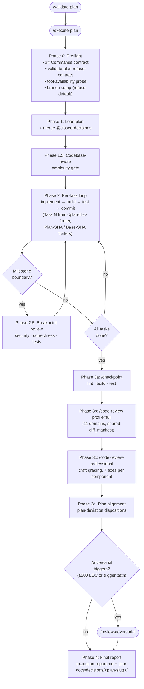
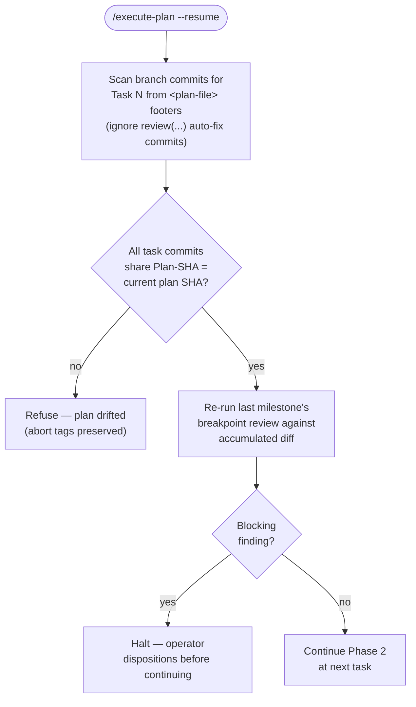
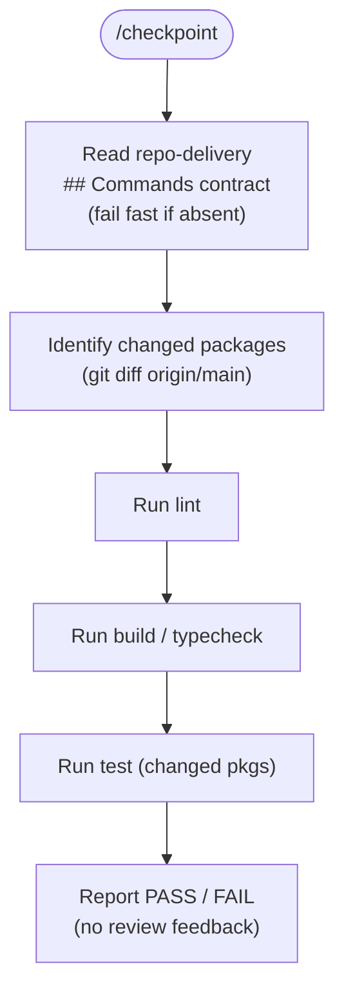
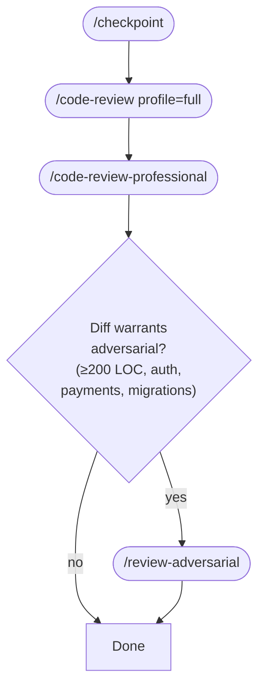
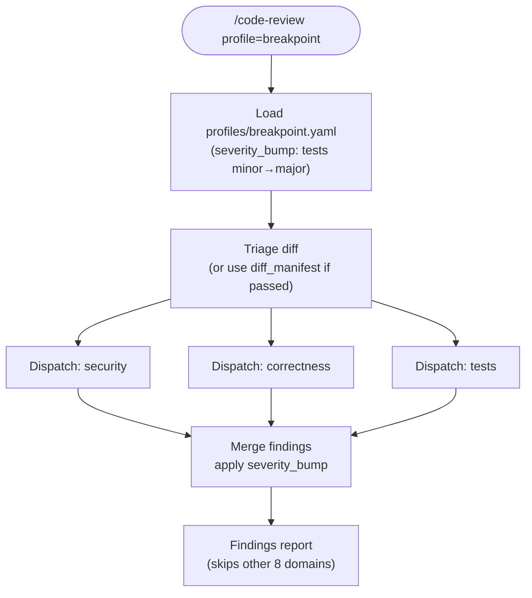
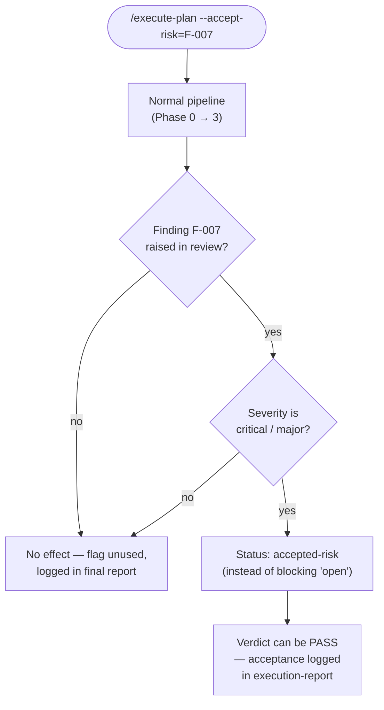
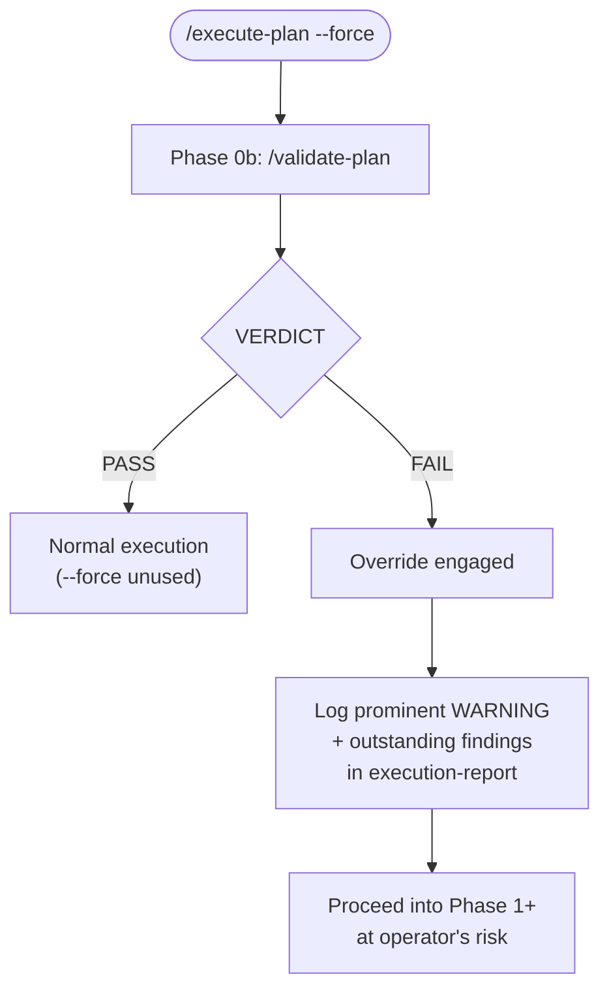

# new-claude-dev-workflow-skills

A plan-to-PR development workflow built as a set of composable Claude
Code skills. The skills enforce staged reviews, a declarative repo
contract, explicit disposition of findings, and preserve-on-failure
git discipline.

The flow is designed so a human writes (or generates) a plan file,
hands it to `/execute-plan`, and receives either a shippable branch
or an auditable abort with preserved state — never silent guessing
or destroyed work.

---

## Prerequisites

Every consuming repo must declare a `## Commands` section in its
`CLAUDE.md`. The schema is defined in
[`_rubrics/repo-delivery/SKILL.md`](./.claude/skills/_rubrics/repo-delivery/SKILL.md).
Missing section → every consuming skill halts with an actionable
error. No manifest-sniffing, no heuristics.

Minimum required fields: `lint`, `build`, `test`, `default_branch`,
`package_manager`. Optional: `adversarial_triggers`, `retry_budget`,
`auto_accept_deviations`, `auto_generated_paths`.

The example in [`CLAUDE.md`](./CLAUDE.md) at the repo root is a
working reference.

---

## User-invokable skills

| Skill | Purpose |
|---|---|
| [`/validate-plan`](./.claude/skills/validate-plan/SKILL.md) | Lightweight structural gate on a plan file — checks task discreteness, verifiable acceptance criteria, milestones, placeholders, ambiguous verbs, and closed-decisions formatting. Emits `VERDICT: PASS` or `VERDICT: FAIL`. |
| [`/execute-plan`](./.claude/skills/execute-plan/SKILL.md) | End-to-end plan executor with staged reviews: plan validation → per-task build/test → breakpoint review at every milestone → full code review + professional grading at the PR boundary → optional adversarial review. Preserves branches on abort; supports `--resume`, `--force`, `--accept-risk`, `--adversarial`. |
| [`/checkpoint`](./.claude/skills/checkpoint/SKILL.md) | Fast quality gate. Runs lint, build, and tests for changed packages. No review feedback — use before a push or PR. |
| [`/code-review`](./.claude/skills/code-review/SKILL.md) | Domain-based PR review controller. Dispatches worker agents across 11 concept lenses (security, correctness, architecture, tests, performance, operability, resilience, concurrency, requirements, data-integrity, api-contract). Two profiles: `breakpoint` (fast mid-flow) and `full` (PR boundary). |
| [`/code-review-professional`](./.claude/skills/code-review-professional/SKILL.md) | Seniority-calibrated craft grading (junior/mid/senior/staff) on 7 axes with 2–3 line citations per axis. Per-component. Not a defect list. |
| [`/review-adversarial`](./.claude/skills/review-adversarial/SKILL.md) | Cross-model adversarial review via Codex or Gemini CLI. Spawns Skeptic/Architect/Minimalist lenses on a different model, synthesizes a verdict, then applies lead judgment on each finding. |

## Internal rubrics (not user-invokable)

Referenced by the skills above; collected in
[`.claude/skills/_rubrics/`](./.claude/skills/_rubrics/).

- `_rubrics/repo-delivery` — the `## Commands` contract schema.
- `_rubrics/disposition` — status vocabulary (`open`, `fixed`,
  `disagree-with-evidence`, `defer`, `accepted-risk`, `resolved`) and
  blocking rules.
- `_rubrics/professional-rubric` — grade and axis definitions for
  craft grading.

## Closed-decisions library

[`.claude/skills/closed-decisions/`](./.claude/skills/closed-decisions/)
ships pre-baked decisions plans can reference with
`@closed-decisions/<category>/<slug>`. Current seed:
`stacks/nextjs-app-router`, `testing/vitest-only`,
`db/postgres-drizzle`. These are tablestakes — workers do not
deliberate, they execute.

---

## Example flows

### 1. Canonical plan-to-PR

The main flow the skill bundle is built around. Assumes a plan exists
at `docs/plans/<slug>.md`.

```
/validate-plan docs/plans/<slug>.md         # optional; execute-plan runs this in Phase 0b
/execute-plan  docs/plans/<slug>.md
```



`/execute-plan` walks the task list, commits per task with a
`Task N from <plan-file>` footer plus `Plan-SHA` and `Base-SHA`
trailers, runs the breakpoint review at each milestone, and at the PR
boundary:

1. `/checkpoint` (lint/build/test).
2. `/code-review` with `profile: full` (11 domains).
3. `/code-review-professional` (per-component grading).
4. Plan-alignment check with `plan-deviation` findings.
5. `/review-adversarial` if diff ≥200 lines or an
   `adversarial_triggers` path changed (default `--adversarial=auto`).

Artefacts written: `execution-report.md` + `execution-report.json`,
plus any decision records under `docs/decisions/<plan-slug>/`.

### 2. Resume after abort

`/execute-plan` never destroys work on failure — it tags
`execute-plan/abort/<slug>-<ts>` and preserves the branch.

```
/execute-plan --resume docs/plans/<slug>.md
```



Refuses if the plan's SHA has drifted since the prior run.

### 3. Fast quality gate before a manual PR

Skip planning entirely; just verify the branch is green.

```
/checkpoint
```



Runs lint, build, and tests for changed packages. No review feedback.

### 4. Ad-hoc review of a hand-written branch

When the diff wasn't produced by `/execute-plan` but you still want
the review stack.

```
/checkpoint
/code-review         # defaults to profile: full
/code-review-professional
/review-adversarial  # optional; only if the diff warrants it
```



Each skill runs standalone — without `/execute-plan`'s `diff_manifest`,
the review skills do their own internal triage.

### 5. Mid-flow check on a feature branch

Before a milestone ships, but before the full PR review is warranted.

```
/code-review profile=breakpoint
```



Runs only `security`, `correctness`, and `tests` lenses. Faster than
`full`; the tests domain severity is bumped `minor → major` at
milestones (defined in `profiles/breakpoint.yaml`).

### 6. Accept a known risk and continue

`/execute-plan` blocks at `critical`/`major` findings unless the
human explicitly accepts one. Use sparingly; each use is logged in
the final report.

```
/execute-plan docs/plans/<slug>.md --accept-risk=F-007
```



### 7. Force-run despite plan-validation failures

For humans only — the harness never sets this. Overridden failures
are logged prominently in the final report.

```
/execute-plan docs/plans/<slug>.md --force
```



---

## Key guarantees

- **Refuse contract.** A plan with `VERDICT: FAIL` is refused at
  Phase 0b. `--force` is the only escape and is audit-logged.
- **Preserve-on-failure.** Aborts tag the last good commit, leave the
  branch intact, and forbid `reset --hard`, `push --force`,
  `branch -D`, and `clean -f` in every code path.
- **No default-branch commits.** `/execute-plan` refuses to run on
  the repo's `default_branch`; pass `--create-branch` or switch
  first.
- **Findings have terminal status.** `open` is not a valid end-state
  at Phase 4. Every meaningful finding ends `fixed`,
  `disagree-with-evidence`, `defer`, or `accepted-risk`.
- **Decision records.** Non-trivial design calls the plan didn't
  prescribe are written to `docs/decisions/<plan-slug>/` with a
  supersede chain, so a future LLM touching the same code doesn't
  silently reverse a past choice.
